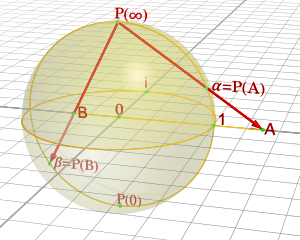
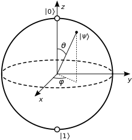

For reasons that we will discuss later on, there is a part of a qubit that we cannot observe or measure.
Start with a generic qubit $$\ket\psi = a\ket 0 + b\ket 1$$ and $$\theta\in [0,2\pi)$$.  Then

$$\ket\phi  = e^{i\theta}\ket\psi = ae^{i\theta}\ket 0 + be^{i\theta}\ket 1$$

and $$\ket\psi$$ are **indistinguishable** by any measurement.  The multiple $$e^{i\theta}$$ is called a **global phase factor**.
Since different qubits which differ only by this global phase can't be differentiated, we might as well think of them as effecively the same.
In this way, we can idenify qubit states with points in the complex projective line.

## The complex projective line

The **complex projective line**, denoted by $$\mathbb{CP}^1$$ is the set of all lines in $$\mathbb C^2$$ passing through the origin.
Any line is completely determined by two points, and since each of these lines contains the origin, it is determined by a single point $$(a,b)\in\mathbb{C}^2$$ different from the origin.
However, different points might determine the same line!

For example, the line passing through the origin and $$(i,2+i)$$ is the same as the one passing through the origin and $$(1,1-2i)$$.  The reason is that the vector $$\binom{i}{2+i}$$ and the vector $$\binom{1}{1-2i}$$ are scalar multiples of one-another!  In fact $$\binom{1}{1-2i} = -i\binom{i}{2+i}$$.

So in the end we can describe lines uniquely by symbols $$[a:b]$$ where here $$a,b\in\mathbb{C}$$, with at least one nonzero, and with the rule that

$$[a: b] = [c:d]\quad\text{if and only if}\quad \binom{c}{d}=\lambda\binom{a}{b}$$

for some nonzero $$\lambda\in\mathbb{C}$$.
Put in terms of equivalence relations, the symbols $$[a:b]$$ are what mathematicians call call **equivalence classes**.
Then we can think about the complex projective line as being the set of symbols

$$\mathbb{CP}^1 = \{[a:b]: a,b\in\mathbb C,\ \ \text{and}\ \ ab\neq 0\}.$$

**Question:** Is $$[1-i:1+2i]$$ the same as $$[2:-1+3i]$$?

  
Click for answer.

  Yes!  This is because $$\binom{1-i}{1+2i} = (1+i)\binom{2}{-1+3i}.$$

### $$\mathbb{CP}^1$$ viewed as a sphere
Geometrically the complex projective line is a two dimensional surface that looks just like a sphere!
The way to see this is divvy up $$\mathbb{CP}^1$$ as

$$\mathbb{CP}^1 = \{[1:z]: z\in\mathbb{C}\}\cup\{[0:1]\}.$$

We can envision the first part as the $$x,y$$-plane since $$z=z+iy$$.
Now imagine adding a three-dimensional glass sphere of radius one centered at the origin, with a light at the top.
If we take a marker and mark any point on the sphere, the point makes a shadow at a unique spot in the plane.
This defines a map from the sphere to the $$x,y$$-plane called **stereographic projection**.

Mathematically, we denote the sphere as $$S^2$$, so 

$$S^2 = \{(x,y,z): x^2+y^2+z^2 = 1\}.$$

Under stereographic projection, a point $$(x,y,z)\in S^2$$ goes to $$(x/(1-z),y/(1-z))$$ in the $$x,y$$-plane or equivalently to the complex number $$(x+iy)/(1-z)$$.
In other words, stereographic projection is a function

$$P: S^2\rightarrow\mathbb{CP}^1,\quad P(x,y,z) = [1: (x+iy)/(1-z)].$$

Now an exception to this rule occurs when $$z=1$$, which geometrically is when we are at the top of our sphere.
The shadow cast from this point seems to go infinitely far away from the origin.
Algebraically, we see this is a problem, since we are *dividing by zero*.
However, there's no need to worry!  Since $$[1: (x+iy)/(1-z)] = [1-z: (x+iy)]$$, it is actually quite natural to send this final point to $$[0:1]$$.
In this way, we can think of the projective line $$\mathbb{CP}^1$$ and the sphere $$S^2$$ as being the same thing!

**Question:** Under stereographic projection, where does the point $$(\sqrt{2}/2,\sqrt{2}/2,0)$$ go to?  What about $$(\sqrt{2}/2,0,\sqrt{2}/2)$$?

  
Click for answer.

  Based on the formula

  $$P(\sqrt{2}/2,\sqrt{2}/2,0) = \frac{\sqrt{2}}{2}(1 + i) = e^{i\pi/4}\ \ \text{and}\ \ P(\sqrt{2}/2,0,\sqrt{2}/2) = \frac{1}{\sqrt{2}-1}$$

## The Bloch sphere

Starting with a qubit $$\ket\phi = a\ket0 + b\ket1$$, we can multiply it by any global phase factor $$e^{i\theta}$$ and get a new qubit which is indistinguishable from the first.
By convention, we usually multiply by $$e^{-i\arg(a)}$$ so that the first coefficient $$a$$ becomes real, or else if $$a=0$$ we can make $$b=1$$.
With this in mind, we will call a qubit with $$a$$ real (or $$a=0$$ and $$b=1$$) in **standard form**.
Given a symbol $$[a:b]$$, there is a unique choice of $$a,b$$ which satisfies the normalization condition that $$\lvert a\rvert^2 + \lvert b\rvert^2 = 1$$ and the condition that $$a$$.
In this way, qubits in standard form are in bijection with points in $$\mathbb{CP}^1$$ and thus with points on the sphere.

Thus if we ignore the global phase, we can represent a qubit $$\ket\psi$$ as a point on the sphere $$S^2$$.
When we are using points on the sphere to represent qubits in this way, we call it the **Bloch sphere**.

Specifically, a point on the unit sphere in sphereical coordinates can be represented by two angles: the angle $$\theta$$ vertically from the $$z$$-axis, and the angle $$\phi$$ horizontally from the $$x$$-axis.

In Cartesian coordinates, the corresponding point is $$(\sin\theta\cos\phi,\sin\theta\sin\phi,\cos\theta)$$.

:warning: The roles of $$\theta$$ and $$\phi$$ are traditionally switched between physics and mathematics, but we are adopting the physical convention given the nature of this course.

Under stereographic projection, the corresponding qubit in standard form is

$$\ket\psi = \cos(\theta/2)\ket0 + e^{i\phi}\sin(\theta/2)\ket1.$$

We will use the Bloch sphere later as an important tool in aiding our understanding of the way that single qubit quantum gates act.

**Question:** What qubit does the point on $$(\sqrt{2}/4,\sqrt{6}/4,\sqrt{2}/2)$$ correspond to?

  
Click for answer.

  In spherical coordinates, the angles are

  $$\theta = \pi/4\quad\text{and}\quad \phi = \pi/3.$$

  Therefore the qubit is

  $$\ket\psi = \cos(\pi/8)\ket0 + (1/2 + i\sqrt{3}/2)\sin(\pi/8)\ket1.$$

